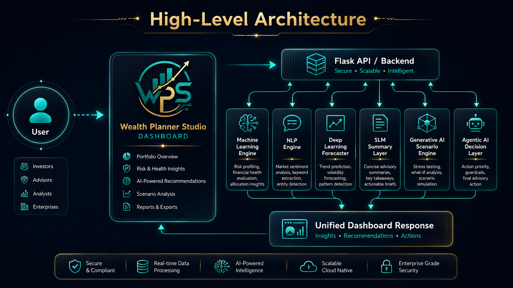
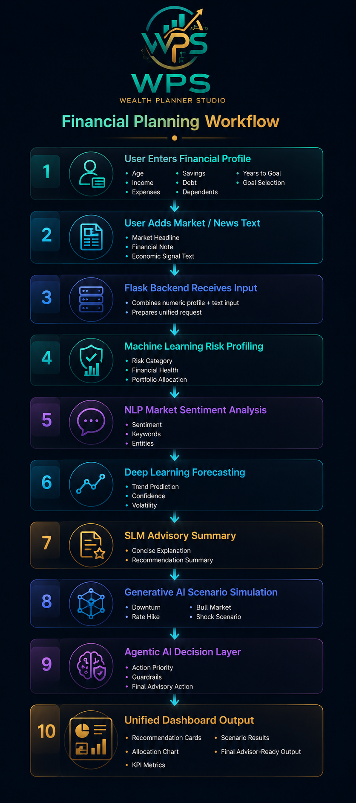

# Wealth Planner Studio - AI Powered Personalized Financial Planning & Wealth Management


**An AI-powered financial advisory dashboard that combines Machine Learning, Deep Learning, NLP, SLM, Generative AI, and Agentic AI to deliver personalized investment recommendations, explainable risk profiling, and scenario-based wealth planning.**

🌐 Live Demo: [Deployed Site](https://wps-q6hh.onrender.com/)

---

## Table of Contents

1. [Features](#features)
   - [Investor Profiling](#investor-profiling)
   - [AI-Powered Portfolio Recommendation](#ai-powered-portfolio-recommendation)
   - [Market Intelligence via NLP](#market-intelligence-via-nlp)
   - [Scenario Simulation](#scenario-simulation)
   - [Agentic Decision Support](#agentic-decision-support)
2. [System Architecture Overview](#system-architecture-overview)
   - [High Level Architecture](#high-level-architecture)
   - [End-to-End Workflow](#end-to-end-workflow)
3. [AI Modules](#ai-modules)
   - [Machine Learning Engine](#machine-learning-engine)
   - [Deep Learning Forecaster](#deep-learning-forecaster)
   - [Natural Language Processing Engine](#natural-language-processing-engine)
   - [Small Language Model Summary Layer](#small-language-model-summary-layer)
   - [Generative AI Scenario Engine](#generative-ai-scenario-engine)
   - [Agentic AI Decision Layer](#agentic-ai-decision-layer)
4. [Design Decisions & Reasoning](#design-decisions--reasoning)
5. [UI/UX Design](#uiux-design)
6. [Tech Stack](#tech-stack)
7. [Project Structure](#project-structure)
8. [Getting Started](#getting-started)
   - [Clone & Install](#1-clone--install)
   - [Environment Setup](#2-environment-setup)
   - [Run Locally](#3-run-locally)
9. [Deployment](#deployment)
10. [Future Improvements](#future-improvements)
11. [License](#license)
12. [Contact](#contact)

---

## Features

### Investor Profiling
- Accepts user financial inputs such as age, income, expenses, savings, debt, dependents, years to goal, and financial goal.
- Computes derived financial indicators including savings rate, debt-to-income ratio, annual savings capacity, and emergency fund coverage.
- Predicts the investor’s risk category as **Conservative**, **Moderate**, or **Aggressive**.

### AI-Powered Portfolio Recommendation
- Generates personalized allocation across **Equity, Debt, Gold, and Cash**.
- Adapts allocation based on investment horizon and detected market sentiment.
- Produces recommendation bullets to guide savings, debt reduction, and allocation discipline.

### Market Intelligence via NLP
- Analyzes financial text or market headlines entered by the user.
- Detects sentiment as **Positive**, **Negative**, or **Neutral**.
- Extracts keywords, financial assets, economic terms, and organizations such as RBI, SEBI, Fed, IMF, NSE, and BSE.

### Scenario Simulation
- Simulates stress-tested market conditions such as **Economic Downturn**, **Interest Rate Hike**, **Bull Market Expansion**, **Geopolitical Shock**, and **Stable Growth**.
- Estimates projected returns and risk levels for each scenario.
- Suggests adjusted portfolio allocations under changing market conditions.

### Agentic Decision Support
- Evaluates all upstream model outputs and assigns action priority.
- Produces a final advisory action such as defensive rebalancing, gradual growth maintenance, or continued disciplined investing.
- Applies a guardrail-based safety layer before approving the action.

---

## System Architecture Overview

> Wealth Planner Studio processes structured investor data and unstructured market text through multiple AI modules, then combines the outputs into a single explainable financial dashboard.

### High Level Architecture



> User Input Form → Flask Backend → ML Engine + NLP Engine + DL Engine + SLM Layer + GenAI Scenario Engine + Agentic AI → Unified Dashboard Response

### Financial Planning Workflow



1. User enters financial and goal-based data.
2. Flask backend sends numeric inputs to the ML service for risk prediction and allocation.
3. User-provided market text is processed by the NLP service for sentiment and keyword extraction.
4. A DL-style forecasting module simulates sequential market trend behavior.
5. The SLM layer converts analytical outputs into a concise advisory summary.
6. The Generative AI module performs scenario-based stress testing.
7. The Agentic AI module selects a priority action with safety validation.
8. All results are returned as JSON and rendered on the dashboard.

---

## AI Modules

### Machine Learning Engine
- Computes financial features from raw input.
- Loads trained artifacts when available from `artifacts.joblib`.
- Falls back to deterministic financial heuristics if trained artifacts are unavailable.
- Returns risk label, confidence score, financial health score, advice, and portfolio allocation.

### Deep Learning Forecaster
- Simulates temporal market sequences using an LSTM-style workflow.
- Detects whether the trend is **Bullish**, **Bearish**, or **Stable**.
- Calculates confidence and volatility based on sequential market movement.
- Compares DL performance with a structured-tabular ML baseline.

### Natural Language Processing Engine
- Cleans and tokenizes user-entered financial text.
- Detects sentiment based on positive and negative finance-related lexicons.
- Extracts domain-specific keywords and recognized financial entities.
- Produces a short text summary for dashboard display.

### Small Language Model Summary Layer
- Converts structured outputs into a human-readable advisory summary.
- Blends profile details, risk class, financial health, allocation, and sentiment context.
- Produces recommendation-focused text for non-technical users.

### Generative AI Scenario Engine
- Creates synthetic variations of major market scenarios.
- Stress tests the recommended allocation under each scenario.
- Suggests adjusted allocations when market risk shifts lower or higher.

### Agentic AI Decision Layer
- Assigns action priority based on risk profile, sentiment, financial health, and severe simulated outcomes.
- Generates a reasoning trace for transparency.
- Uses a safety check to block actions that conflict with the user’s risk profile.
- Produces a final decision log with timestamps and rationale.

---

## Design Decisions & Reasoning

- Chose **Flask** because it is lightweight and integrates easily with modular Python AI services.
- Used a **modular service architecture** so each AI component can be upgraded independently.
- Added a **fallback rule-based ML path** to keep the app functional even if model artifacts are missing.
- Used **scenario simulation** to move beyond static recommendations and improve real-world advisory relevance.
- Included **agentic safety checks** to show responsible AI behavior rather than unrestricted autonomous action.
- Designed the UI as a single-screen dashboard for fast interpretation during demos and presentations.

---

## UI/UX Design

The dashboard is designed as a modern financial analytics interface with:

- Sticky top navigation and a branded hero section
- Responsive form-based investor input workspace
- KPI cards for risk, confidence, health, and market sentiment
- Doughnut chart for portfolio allocation
- Explainable evidence sections such as feature importance, confusion matrix, and ROC summary
- Scenario cards, recommendation cards, and advisory summaries for decision support

---

## Tech Stack

- **Frontend**: HTML5, CSS3, Vanilla JavaScript, Chart.js
- **Backend**: Python, Flask
- **Machine Learning**: Scikit-learn, NumPy, Pandas, Joblib
- **Natural Language Processing**: Regex-based preprocessing, rule-based sentiment logic, keyword extraction
- **Deep Learning Simulation**: Python sequential trend workflow with LSTM-style abstraction
- **Generative AI**: Synthetic scenario generation and stress testing engine
- **Agentic AI**: Rule-based decision agent with reasoning trace and safety checks
- **Deployment**: GitHub + Render + Gunicorn

---

## Project Structure

```bash
Wealth_Planner_Studio/
│
├── app.py
├── requirements.txt
├── models/
│   └── artifacts.joblib
├── services/
│   ├── ml_service.py
│   ├── dl_service.py
│   ├── nlp_service.py
│   ├── slm_service.py
│   ├── genai_service.py
│   └── agent_service.py
├── static/
│   ├── style.css
│   └── script.js
└── templates/
    └── index.html
```
## Demo Video
[▶ Watch WPS Demo](assets/videos/WPS_WRK_VDO.mp4)
---

## Getting Started

### 1. Clone & Install
```bash
git clone https://github.com/chandru0708/Wealth_Planner_Studio.git
cd Wealth_Planner_Studio
pip install -r requirements.txt
```

### 2. Environment Setup
Create a virtual environment and activate it:

```bash
python -m venv venv
source venv/bin/activate   # Mac/Linux
venv\Scripts\activate      # Windows
```

### 3. Run Locally
```bash
python app.py
```

Then open:

```bash
http://127.0.0.1:5000
```

---

## Deployment

This project can be deployed on **Render** as a Flask web service.

### Render Settings
- **Build Command**
```bash
pip install -r requirements.txt
```

- **Start Command**
```bash
gunicorn app:app
```

### GitHub Workflow
- Keep `main` as stable **v1**.
- Push upgraded versions using separate branches such as `v2`.
- Connect the required branch to Render for controlled deployment.

---

## Future Improvements

- Replace rule-based NLP with transformer-based finance sentiment models.
- Upgrade the DL simulation to a true TensorFlow or PyTorch LSTM model.
- Add authentication and client portfolio history tracking.
- Store advisory sessions in a database for longitudinal financial planning.
- Add downloadable PDF financial reports and advisor notes.
- Integrate live market APIs for real-time signals instead of manual text entry.

---

## License

This project is licensed under the MIT License. Add a `LICENSE` file if the repository is intended for open-source distribution.

---

## Contact
- **GitHub:** [chandru0708](https://github.com/chandru0708)
- **Project Repository:** [Wealth Planner Studio](https://github.com/chandru0708/Wealth_Planner_Studio)
